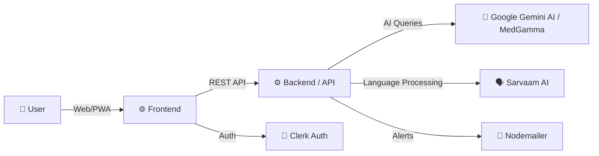
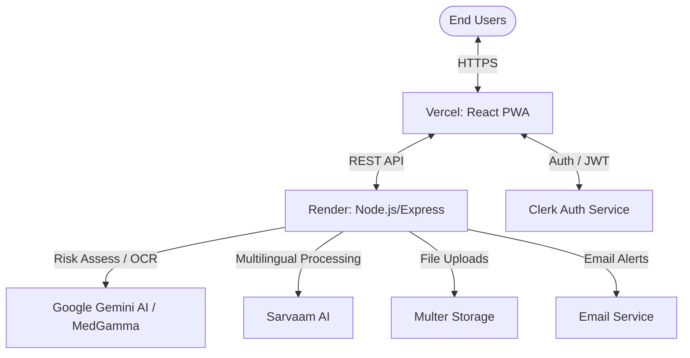
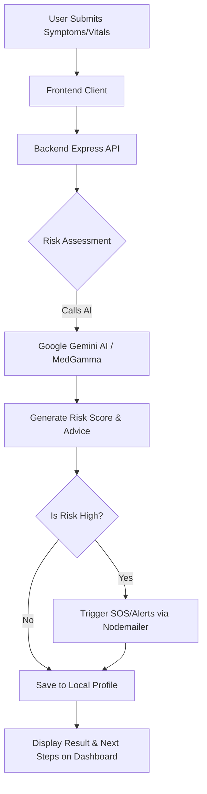

# 🤰 MaaRaksha

> **AI-Powered Maternal Health Early Warning Network for Rural India**

MaaRaksha is a comprehensive, multi-role platform designed to tackle the high maternal mortality rate in rural areas by enabling early detection of high-risk pregnancies. Through AI-driven risk assessment, multilingual voice reporting, and real-time dashboards for healthcare workers, it bridges the communication gap between pregnant women, their families, and medical professionals.


---

## 🛠 Tech Stack

Our platform leverages a modern, robust, and scalable technology stack tailored for performance and accessibility.



| Layer | Technology | Purpose |
|---|---|---|
| **Frontend** | React 19, TypeScript, Vite, TailwindCSS v4 | High-performance, responsive, and accessible UI rendering. |
| **Backend** | Node.js, Express.js | Fast, unopinionated backend for handling API requests and business logic. |
| **AI / ML** | Google Gemini AI / MedGamma | AI-driven risk assessment and medical report OCR. |
| **Language Processing** | Sarvaam AI | Multilingual language translation and voice processing. |
| **Authentication** | Clerk | Secure user authentication and session management. |
| **Data Viz & UI** | Chart.js, Framer Motion | Data visualization for health trends and smooth micro-interactions. |
| **Email Service** | Nodemailer | Sending real-time critical alerts to families and health workers. |

---

## ✨ Features

### 👩‍🍼 Pregnant Women Features
- **Multilingual Voice Check-ins:** Allows users to perform voice or text symptom reporting in 6 Indian languages (handled by **Sarvaam AI**), making the application highly accessible to rural populations.
- **Daily Health Tracking:** Users can log vitals, symptoms, and mood to receive an immediate AI-generated risk forecast.
- **Fetal Development Tracking:** Provides a week-by-week visual tracking of the baby's growth and developmental milestones.
- **SOS Alerts:** A one-tap emergency button that immediately notifies family members and local health workers when critical care is needed.

### 👩‍⚕️ ASHA Worker Dashboard
- **AI-Sorted Priority List:** Automatically categorizes pregnancies in the village by risk (GREEN/YELLOW/RED), replacing paper registers and highlighting who needs immediate attention.
- **Follow-up Reminders:** Automated scheduling and reminders for upcoming check-ups and medical interventions.

### 🏥 Medical & Admin Dashboards (PHC & District)
- **Real-time Analytics:** District officers get population-level visibility and village heatmaps to allocate resources efficiently.
- **Clinical Reports:** PHC admins can review detailed medical reports and risk analytics for individual patients.

### 🤖 AI-Powered Capabilities
- **Risk Assessment:** Analyzes clinical parameters (symptoms, BP, etc.) to generate a risk score (0-100) and actionable next steps.
- **Report OCR Analysis:** Parses uploaded medical reports (PDF/Images) using Gemini Vision to extract key insights without manual data entry.
- **AI Health Assistant:** Multi-turn chatbot providing personalized maternal health advice.

### 🔐 Security & Privacy
- **Role-Based Access Control (RBAC):** Secure access isolation between patients, families, and various levels of healthcare workers.
- **Secure Authentication:** Managed via Clerk, ensuring secure credentials handling and session validation.

---

## 📐 System Architecture



---

## ⚙️ How It Works



---

## 📁 Project Structure

```text
maarakshak/
├── src/                    # Frontend source code
│   ├── assets/             # Images, SVGs, fetal development visuals
│   ├── components/         # Reusable UI components (auth, charts, voice)
│   ├── contexts/           # React context for state management
│   ├── features/           # Feature-based modules (dashboards by role)
│   ├── lib/                # API clients, utilities, firebase/clerk config
│   └── locales/            # i18n translation files (6 languages)
├── server/                 # Backend source code
│   ├── src/
│   │   ├── services/       # Core business logic (gemini, riskEngine, alerts)
│   │   └── index.ts        # Express app and routing
│   ├── package.json        # Backend dependencies
│   └── tsconfig.json
├── package.json            # Root frontend dependencies and workspaces
├── vite.config.ts          # Vite build configuration
└── README.md
```

---

## 🚀 Installation & Setup

Follow these steps to get the project running locally.

### 1. Clone the repository
```bash
git clone https://github.com/your-username/maarakshak.git
cd maarakshak
```

### 2. Install dependencies
```bash
npm run install-all
```

### 3. Configure environment variables
Create a `.env.local` file in the root directory for the frontend and a `.env` in the `server` directory for the backend. 

**Example Environment Variables (`.env.example`):**
```env
# Frontend (.env.local)
VITE_CLERK_PUBLISHABLE_KEY=your_clerk_key
VITE_API_BASE_URL=http://localhost:5000/api

# Backend (server/.env)
PORT=5000
GEMINI_API_KEY=your_google_gemini_key
EMAIL_USER=your_email@gmail.com
EMAIL_PASS=your_app_password
```

### 4. Start the development server
Run both the frontend and backend concurrently from the root directory:
```bash
npm run dev
```
The frontend will be available at `http://localhost:5173` and the backend at `http://localhost:5000`.

---

## 💻 Usage

- **Demo Mode:** If you do not have Clerk configured, the app will run in Demo Mode. You can log in using preset roles (Woman, ASHA, Admin, etc.) directly from the login screen to test functionalities without needing a real account.
- **Patient Workflow:** Log in as a 'Woman', complete the initial onboarding profile (gestational age, weight, pre-existing conditions), and navigate to the dashboard to log daily check-ins.
- **Health Worker Workflow:** Log in as an 'ASHA Worker' to view a prioritized list of pregnant women needing immediate attention based on their latest check-ins.

---

## 🧠 API / AI Integration

MaaRaksha heavily relies on Google Gemini AI / MedGamma to process unstructured health data.

- **Google Gemini API / MedGamma (`gemini-2.5-flash`):** Used as the primary engine for analyzing patient symptoms and vital signs, providing medical OCR, and managing risk scoring.
- **Sarvaam AI:** Handles all multilingual language processing, translations, and voice support for local Indian languages.
- **Purpose:** 
  - Generates numerical risk scores and categorized risk levels (GREEN/YELLOW/RED).
  - Acts as a conversational AI health assistant.
  - Performs OCR and analysis on uploaded medical reports.
- **Data Flow:** The frontend sends patient text/voice inputs or documents to the Node.js backend. The backend constructs a clinical prompt and securely queries the Gemini API / MedGamma. The response is formatted into JSON and passed back to the frontend for visualization.
- **Requirements:** `GEMINI_API_KEY` must be configured in the backend `.env` file.

---

## 🛡 Security & Privacy

Ensuring the privacy and security of maternal health data is a top priority:

- **Authentication:** Handled by Clerk Auth, utilizing secure, industry-standard JWT sessions.
- **Authorization (RBAC):** Strict Role-Based Access Control ensures users only see data relevant to their specific role.
- **Environment Variables:** Secrets and API keys are strictly maintained in `.env` files and are never exposed to the client repository.
- **Graceful Degradation:** A local fallback Risk Scoring engine is implemented in the backend if the AI service becomes unavailable, ensuring uninterrupted care.

---

## 📸 Screenshots

| Splash Screen | Patient Dashboard |
|---|---|
|  |  |

| ASHA Worker View | AI Risk Analysis |
|---|---|
|  |  |

---

## 🚀 Future Scope

While the core functionality is active, the following enhancements are planned:
- **WhatsApp Integration:** Automate notifications and check-ins via WhatsApp to reach users without internet or smartphone access.
- **Wearable Device Integration:** Auto-sync vitals (Heart rate, SpO2) from smartwatches or clinical bands.
- **Predictive ML Models:** Train a custom, lightweight ML model specifically on regional maternal health datasets for localized accuracy.
- **Offline Mode Synchronization:** Robust PWA offline syncing when devices reconnect to the internet in remote areas.

---

## 👨‍💻 Team / Contributors

- **Contributors** - Developers & Architects
- *Contributions are welcome! Please open an issue or pull request if you'd like to help improve MaaRaksha.*

---

## 📄 License

This project is licensed under the MIT License - see the [LICENSE](LICENSE) file for details.
